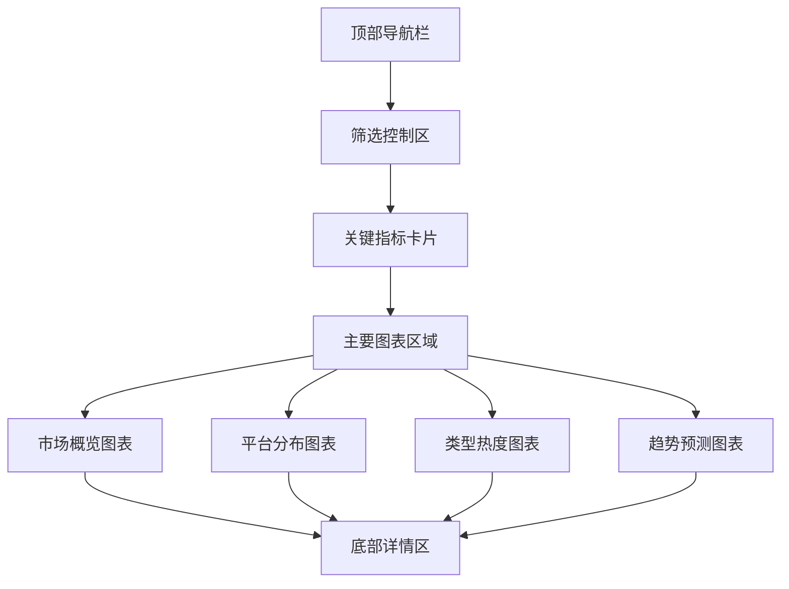
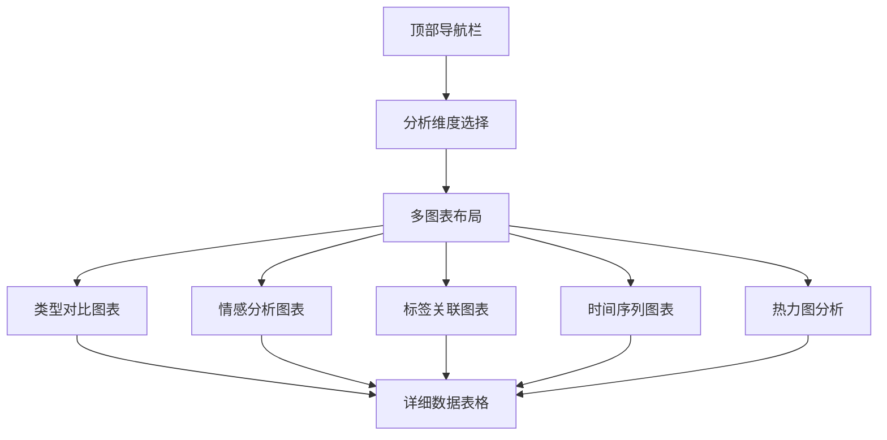
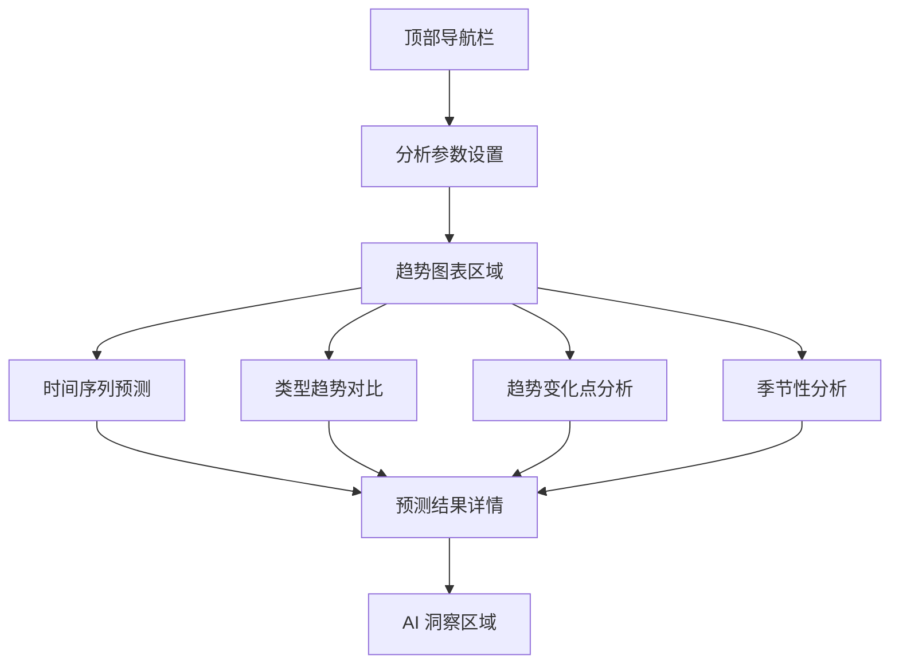
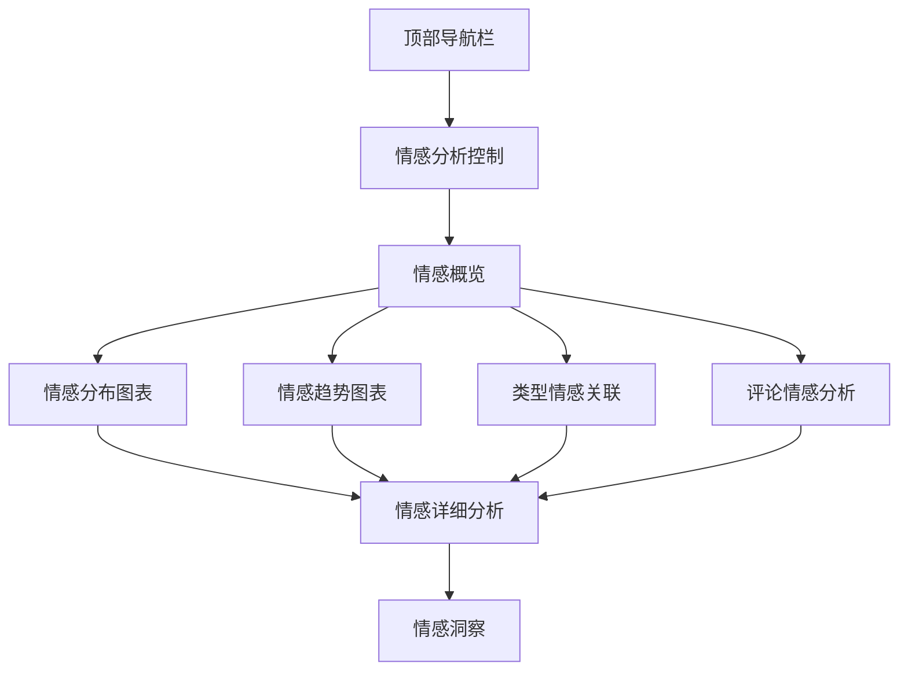
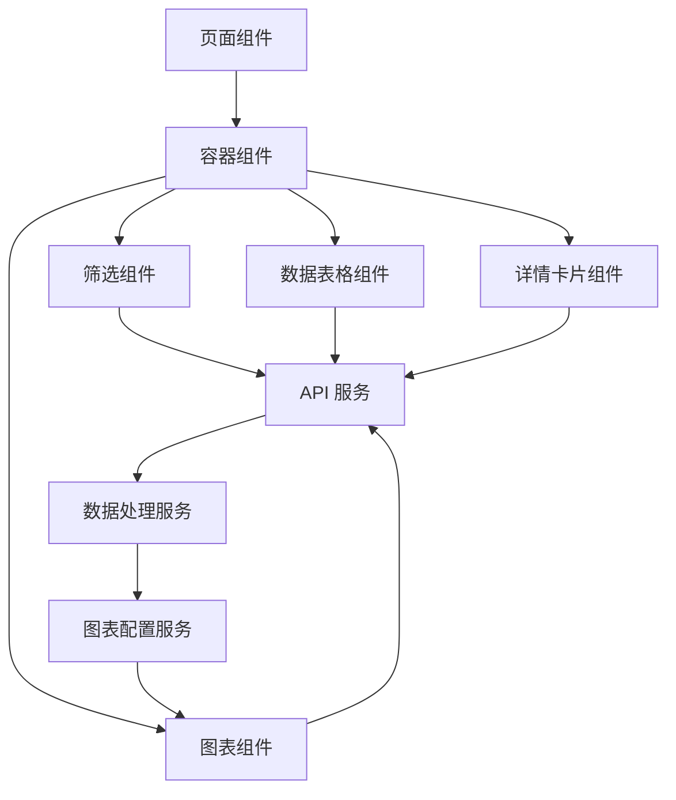

# 数据可视化方案

## 1. 可视化系统概述

本数据可视化方案旨在通过直观、交互性强的图表展示，帮助用户理解网民小说偏好的复杂数据，发现潜在的市场趋势和机会。系统采用现代前端技术栈，结合 Ant Design Charts 库，实现从宏观市场概览到微观类型分析的全维度可视化，支持实时数据更新和个性化配置。

## 2. 核心可视化页面

### 2.1 市场概览仪表板

**页面布局**:

**核心组件**:

1. **关键指标卡片**
   - 总作品数
   - 活跃用户数
   - 平均热度指数
   - 市场增长率
   - 情感得分

2. **市场概览图表**
   - 大型折线图：展示整体市场趋势
   - 支持时间范围选择
   - 显示关键转折点

3. **平台分布图表**
   - 饼图：各平台市场占比
   - 环形图：平台活跃度对比
   - 平台切换功能

4. **类型热度图表**
   - 水平柱状图：热门类型排序
   - 支持按热度、增长率、情感得分排序
   - 类型详情弹出框

5. **趋势预测图表**
   - 折线图：历史数据 + 预测数据
   - 置信区间显示
   - 预测时间范围选择

### 2.2 深度分析页面

**页面布局**:

**核心组件**:

1. **类型对比图表**
   - 雷达图：多维度类型特征对比
   - 支持选择多个类型进行对比
   - 特征权重调整

2. **情感分析图表**
   - 柱状图：各类型情感得分
   - 饼图：情感分布
   - 情感变化趋势图

3. **标签关联图表**
   - 网络图：标签关联关系
   - 热力图：标签-类型关联强度
   - 标签云：热门标签展示

4. **时间序列图表**
   - 多线折线图：多个类型趋势对比
   - 支持缩放和区域选择
   - 异常点标记

5. **热力图分析**
   - 类型-平台热力图
   - 类型-时间热力图
   - 热度强度颜色编码

### 2.3 趋势分析页面

**页面布局**:

**核心组件**:

1. **时间序列预测**
   - 折线图：历史数据 + 预测数据
   - 不同预测模型对比
   - 预测准确率评估

2. **类型趋势对比**
   - 堆叠面积图：多类型趋势对比
   - 支持类型选择和时间范围调整
   - 趋势交叉点标记

3. **趋势变化点分析**
   - 折线图：展示趋势变化
   - 变化点自动标记
   - 变化原因分析

4. **季节性分析**
   - 柱状图：展示季节性模式
   - 周期识别
   - 季节性强度评估

5. **AI 洞察区域**
   - 基于大语言模型的趋势解读
   - 自动生成的洞察点
   - 行动建议

### 2.4 情感分析页面

**页面布局**:

**核心组件**:

1. **情感分布图表**
   - 饼图：整体情感分布
   - 堆叠柱状图：各类型情感分布
   - 情感强度分布图

2. **情感趋势图表**
   - 折线图：情感得分时间趋势
   - 情感变化率图表
   - 关键事件标记

3. **类型情感关联**
   - 散点图：类型热度 vs 情感得分
   - 气泡图：情感关联强度
   - 类型情感聚类

4. **评论情感分析**
   - 词云：情感关键词
   - 评论情感分类
   - 情感极性分布

5. **情感洞察**
   - 情感驱动因素分析
   - 情感与热度关联分析
   - 情感优化建议

## 3. 图表类型设计

### 3.1 基础图表类型

| 图表类型 | 适用场景 | 配置选项 | 交互功能 |
|---------|---------|---------|----------|
| 折线图 | 趋势分析、时间序列 | 平滑度、线条样式、标记点 | 缩放、悬停详情、区域选择 |
| 柱状图 | 比较分析、排名展示 | 颜色、排序、标签位置 | 排序切换、详情弹出、数据导出 |
| 饼图 | 占比分析、分布展示 | 半径、标签样式、颜色方案 | 扇区高亮、详情弹出、图例交互 |
| 雷达图 | 多维度对比 | 轴范围、网格样式、多边形填充 | 维度选择、对比模式、数值显示 |
| 热力图 | 关联强度分析 | 颜色梯度、标签显示、单元格大小 | 悬停详情、排序切换、筛选 |
| 散点图 | 相关性分析 | 气泡大小、颜色编码、坐标轴范围 | 聚类显示、趋势线、详情弹出 |
| 词云 | 文本分析 | 字体大小、颜色方案、布局方式 | 点击详情、筛选、导出 |
| 网络图 | 关系分析 | 节点大小、连线强度、布局算法 | 缩放、拖拽、节点详情 |

### 3.2 复合图表设计

1. **趋势预测图表**
   - 基础：折线图
   - 叠加：预测区间（阴影区域）
   - 标记：关键转折点
   - 交互：时间范围选择、模型切换

2. **多维度对比图表**
   - 基础：雷达图
   - 叠加：多个类型数据
   - 标记：最优值点
   - 交互：维度权重调整、类型选择

3. **热力关联图表**
   - 基础：热力图
   - 叠加：数值标签
   - 标记：强关联区域
   - 交互：行列排序、筛选

4. **情感分析图表**
   - 基础：柱状图
   - 叠加：情感强度线
   - 标记：情感变化点
   - 交互：类型选择、时间范围调整

## 4. 交互功能设计

### 4.1 筛选与控制

**核心筛选器**:

1. **时间范围选择**
   - 预设选项：7天、30天、90天、180天、1年
   - 自定义日期范围
   - 相对时间选择（如：最近3个月）

2. **平台选择**
   - 多选平台
   - 平台分组（如：主流平台、新兴平台）
   - 平台对比模式

3. **类型选择**
   - 多选类型
   - 类型分组（如：传统类型、新兴类型）
   - 类型搜索

4. **指标选择**
   - 热度指数
   - 增长率
   - 情感得分
   - 市场份额
   - 留存率

### 4.2 图表交互

**通用交互**:

1. **悬停详情**
   - 显示详细数据
   - 支持格式化（如：百分比、千分位）
   - 显示对比数据（如：与平均值对比）

2. **点击操作**
   - 弹出详细信息卡片
   - 跳转到详情页面
   - 触发相关分析

3. **缩放与平移**
   - 鼠标滚轮缩放
   - 拖拽平移
   - 双击重置

4. **数据导出**
   - 导出为图片（PNG、SVG）
   - 导出为数据（CSV、JSON）
   - 导出为报告（PDF）

**高级交互**:

1. **图表联动**
   - 选择一个图表中的元素，其他图表自动更新
   - 支持主从联动模式
   - 联动范围可配置

2. **实时数据更新**
   - 自动刷新间隔设置
   - 实时数据标记
   - 增量更新机制

3. **个性化配置**
   - 保存图表配置
   - 自定义仪表盘布局
   - 主题切换（亮色/暗色）

4. **协作功能**
   - 分享仪表盘链接
   - 导出配置模板
   - 评论和标注

## 5. 响应式设计

### 5.1 布局适配

| 设备类型 | 屏幕宽度 | 布局策略 | 组件调整 |
|---------|---------|---------|----------|
| 桌面端 | >1200px | 多列网格布局 | 完整功能展示 |
| 平板端 | 768px-1200px | 双列网格布局 | 部分功能折叠 |
| 移动端 | <768px | 单列布局 | 核心功能优先 |

### 5.2 交互适配

1. **桌面端**
   - 鼠标悬停交互
   - 键盘快捷键
   - 拖拽调整布局

2. **平板端**
   - 触摸友好的控件大小
   - 滑动手势支持
   - 简化的导航菜单

3. **移动端**
   - 垂直滚动布局
   - 底部导航栏
   - 简化的图表交互

### 5.3 性能优化

1. **图表渲染优化**
   - 大数据集分页加载
   - 图表懒加载
   - WebGL 加速（对于大型图表）

2. **数据处理优化**
   - 服务端数据预处理
   - 客户端数据缓存
   - 增量数据更新

3. **网络优化**
   - 数据压缩
   - 批量请求
   - 数据预加载

## 6. 技术实现方案

### 6.1 技术栈选择

| 类别 | 技术 | 版本 | 用途 |
|------|------|------|------|
| 前端框架 | React | 18+ | 组件化开发 |
| UI 库 | Ant Design | 5+ | 界面组件 |
| 图表库 | Ant Design Charts | 2.0+ | 数据可视化 |
| 状态管理 | Redux Toolkit | 2.0+ | 全局状态管理 |
| 网络请求 | Axios | 1.6+ | API 调用 |
| 路由 | React Router | 6.0+ | 页面导航 |
| 样式 | Less | 4.0+ | 样式管理 |
| 构建工具 | Vite | 5.0+ | 开发和构建 |
| 类型检查 | TypeScript | 5.0+ | 类型安全 |

### 6.2 组件架构

### 6.3 关键实现细节

1. **图表配置管理**
   - 集中式图表配置存储
   - 配置版本控制
   - 配置模板系统

2. **数据处理管道**
   - 原始数据 → 清洗 → 转换 → 聚合 → 可视化
   - 支持中间数据缓存
   - 错误处理和数据验证

3. **状态管理**
   - 全局状态：用户配置、筛选条件
   - 局部状态：图表交互、动画状态
   - 持久化：本地存储用户配置

4. **API 集成**
   - RESTful API 调用
   - WebSocket 实时数据
   - GraphQL 复杂查询

## 7. 扩展功能

### 7.1 智能分析助手

**功能设计**:

1. **自然语言查询**
   - 支持中文自然语言查询
   - 自动转换为图表展示
   - 保存常用查询

2. **AI 洞察生成**
   - 基于图表数据自动生成洞察
   - 识别异常模式
   - 提供预测分析

3. **个性化推荐**
   - 基于用户浏览历史推荐图表
   - 智能仪表盘布局建议
   - 相关分析推荐

### 7.2 高级分析工具

**功能设计**:

1. **自定义分析**
   - 拖拽式分析构建
   - 自定义指标计算
   - 多数据源整合

2. **假设检验**
   - A/B 测试分析
   - 统计显著性检验
   - 结果可视化

3. **预测模型**
   - 多种预测模型选择
   - 模型参数调优
   - 预测结果评估

### 7.3 行业报告生成

**功能设计**:

1. **自动报告**
   - 定期生成行业报告
   - 支持多格式导出
   - 自定义报告模板

2. **报告共享**
   - 在线预览
   - 链接分享
   - 协作编辑

3. **报告分析**
   - 报告内容搜索
   - 历史报告对比
   - 关键指标追踪

## 8. 实施计划

### 8.1 短期计划（1-2周）

1. **基础框架搭建**
   - 初始化项目结构
   - 集成核心依赖
   - 搭建基础布局

2. **核心图表实现**
   - 实现基础图表组件
   - 集成数据处理服务
   - 构建筛选控制组件

3. **市场概览页面**
   - 实现关键指标卡片
   - 开发市场趋势图表
   - 构建平台分布图表

### 8.2 中期计划（3-4周）

1. **深度分析页面**
   - 实现多维度对比图表
   - 开发情感分析图表
   - 构建标签关联图表

2. **趋势分析页面**
   - 实现时间序列预测
   - 开发类型趋势对比
   - 构建趋势变化点分析

3. **交互功能增强**
   - 实现图表联动
   - 开发实时数据更新
   - 构建个性化配置

### 8.3 长期计划（1-2个月）

1. **高级功能实现**
   - 集成智能分析助手
   - 开发高级分析工具
   - 构建行业报告生成

2. **性能优化**
   - 图表渲染优化
   - 数据处理优化
   - 网络请求优化

3. **生态系统建设**
   - 开放图表组件库
   - 建立配置模板市场
   - 开发API文档和示例

## 9. 预期成果

1. **用户体验提升**
   - 直观、美观的可视化界面
   - 流畅、响应式的交互体验
   - 个性化、可配置的分析视图

2. **分析能力增强**
   - 多维度、多层次的数据分析
   - 实时、准确的市场洞察
   - 智能、预测性的趋势分析

3. **业务价值实现**
   - 为内容创作提供数据指导
   - 为平台运营提供决策支持
   - 为市场投资提供风险评估

4. **技术创新**
   - 构建行业领先的可视化系统
   - 集成前沿的分析技术
   - 推动数据可视化在网络文学领域的应用

## 10. 风险评估

| 风险 | 影响 | 应对策略 |
|------|------|----------|
| 数据量过大 | 图表渲染缓慢 | 实现数据分页加载和虚拟滚动 |
| 浏览器兼容性 | 部分功能无法使用 | 进行多浏览器测试，提供降级方案 |
| 性能瓶颈 | 页面响应缓慢 | 优化数据处理，使用缓存机制 |
| 复杂度增加 | 开发和维护成本高 | 模块化设计，建立组件库 |
| 需求变更 | 开发计划调整 | 采用敏捷开发，灵活应对变更 |

## 11. 结论

本数据可视化方案通过构建全面、交互性强的可视化系统，为网民小说偏好分析提供了直观、高效的工具。系统不仅满足当前的分析需求，还预留了充足的扩展空间，能够随着业务发展和技术进步不断进化。通过数据可视化的力量，我们可以更深入地理解网络文学市场，发现潜在的机会和趋势，为行业的健康发展提供数据支持。