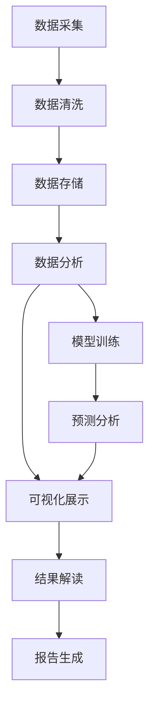

# 网民小说偏好分析计划

## 1. 项目概述

本计划旨在构建一个全面的网民小说偏好分析系统，通过多维度数据采集、深度分析和直观可视化，帮助理解当前网络小说市场的用户偏好趋势，为内容创作、平台运营和市场决策提供数据支持。

## 2. 数据收集策略

### 2.1 数据来源

| 平台 | 数据类型 | 采集频率 | 数据价值 |
|------|---------|---------|----------|
| 起点中文网 | 排行榜、收藏数、推荐票、评论 | 每日 | 主流网络文学平台，用户基数大 |
| 番茄小说 | 阅读量、追更率、评论情感 | 每日 | 免费阅读模式，用户增长快 |
| 纵横中文网 | 新书榜、分类榜、订阅数据 | 每日 | 老牌文学平台，数据质量高 |
| 抖音 | 小说相关话题热度、短视频互动 | 每日 | 社交媒体影响力 |
| 微博 | 小说话题讨论、作者互动 | 每日 | 社会热点反映 |

### 2.2 数据采集方法

1. **API 接口调用**
   - 利用各平台开放API获取官方数据
   - 实现自动化数据采集脚本
   - 建立数据采集任务调度系统

2. **网页爬虫**
   - 针对无API的平台开发定向爬虫
   - 遵守robots.txt规则，控制采集频率
   - 实现数据去重和清洗机制

3. **用户调研**
   - 定期开展问卷调查
   - 收集用户阅读习惯和偏好数据
   - 补充定量数据分析的不足

## 3. 数据分析框架

### 3.1 核心分析维度

1. **类型偏好分析**
   - 各小说类型的 popularity 指数
   - 类型偏好的时间变化趋势
   - 不同平台的类型偏好差异

2. **情感分析**
   - 评论情感倾向分析
   - 类型情感关联度
   - 情感变化趋势

3. **市场洞察**
   - 热门元素组合分析
   - 新兴类型识别
   - 市场饱和度评估

4. **趋势预测**
   - 类型热度预测
   - 季节性变化分析
   - 长期趋势识别

### 3.2 分析方法

1. **统计分析**
   - 描述性统计
   - 相关性分析
   - 差异性检验

2. **机器学习**
   - 时间序列预测（Linear Regression）
   - 情感分析（文本分类）
   - 聚类分析（类型分组）

3. **深度学习**
   - 评论情感分析（BERT模型）
   - 趋势预测（LSTM模型）
   - 内容推荐算法优化

## 4. 数据可视化方案

### 4.1 核心可视化页面

1. **市场概览**
   - 平台数据对比仪表板
   - 类型分布饼图
   - 热度趋势折线图

2. **深度分析**
   - 多维度柱状图
   - 雷达图（类型特征对比）
   - 热力图（时间-类型热度矩阵）

3. **趋势预测**
   - 时间序列预测图
   - 类型对比趋势
   - 趋势变化点分析

4. **情感分析**
   - 情感分布饼图
   - 类型-情感关联图
   - 情感趋势变化

### 4.2 交互设计

- 多平台数据切换
- 时间范围选择
- 类型筛选
- 数据导出功能
- 自定义图表配置

## 5. 结果解读指南

### 5.1 关键指标解释

| 指标 | 计算方法 | 含义 | 参考阈值 |
|------|---------|------|----------|
| 热度指数 | 综合阅读量、收藏数、推荐票 | 类型受欢迎程度 | >80为热门 |
| 增长率 | (当前值-上期值)/上期值 | 类型增长速度 | >0为增长 |
| 情感指数 | 正面评论比例-负面评论比例 | 用户情感倾向 | >0.5为正面 |
| 市场份额 | 类型作品数/总作品数 | 类型市场占比 | >10%为主要类型 |
| 趋势预测值 | 机器学习模型预测结果 | 未来热度预测 | 结合历史数据解读 |

### 5.2 分析结论生成

1. **类型热度排名**
   - 识别当前最受欢迎的小说类型
   - 分析热度变化趋势

2. **用户群体特征**
   - 不同平台用户偏好差异
   - 年龄层阅读偏好分析

3. **市场机会识别**
   - 未被充分满足的类型需求
   - 新兴类型潜力评估

4. **风险预警**
   - 饱和类型识别
   - 热度下降类型预警

## 6. 系统架构

### 6.1 技术栈

| 模块 | 技术 | 版本 | 用途 |
|------|------|------|------|
| 后端 | Python | 3.10+ | 数据处理、分析计算 |
| 前端 | React | 18+ | 用户界面、数据可视化 |
| 数据库 | PostgreSQL | 15+ | 数据存储、查询 |
| 机器学习 | scikit-learn | 1.3+ | 趋势预测、数据分析 |
| 数据可视化 | Ant Design Charts | 5+ | 图表展示 |
| 爬虫 | Scrapy | 2.11+ | 数据采集 |

### 6.2 系统流程图

## 7. 实施计划

### 7.1 阶段划分

| 阶段 | 时间 | 主要任务 |
|------|------|----------|
| 准备阶段 | 1周 | 系统设计、环境搭建 |
| 数据采集阶段 | 2周 | 爬虫开发、API对接 |
| 分析实现阶段 | 3周 | 算法开发、模型训练 |
| 可视化阶段 | 2周 | 前端开发、图表实现 |
| 测试优化阶段 | 1周 | 系统测试、性能优化 |
| 部署上线阶段 | 1周 | 系统部署、文档编写 |

### 7.2 关键里程碑

1. **数据采集系统完成**
   - 多平台数据采集功能实现
   - 数据质量验证通过

2. **分析模型训练完成**
   - 趋势预测模型准确率达到85%+ 
   - 情感分析模型F1值达到80%+ 

3. **可视化系统完成**
   - 核心分析页面实现
   - 交互功能测试通过

4. **系统集成测试**
   - 端到端功能测试通过
   - 性能指标达标

## 8. 持续优化策略

### 8.1 数据更新机制

- 建立自动化数据更新流程
- 实现数据质量监控系统
- 定期数据备份和清理

### 8.2 模型优化

- 定期重新训练预测模型
- 引入新特征提升模型精度
- 探索更先进的算法

### 8.3 功能扩展

- 增加用户画像分析
- 引入竞品分析功能
- 开发个性化推荐系统

### 8.4 系统维护

- 建立监控告警机制
- 定期系统性能评估
- 安全漏洞扫描

## 9. 预期成果

1. **分析报告**
   - 月度小说市场分析报告
   - 季度趋势预测报告
   - 年度行业洞察报告

2. **决策支持**
   - 内容创作方向建议
   - 平台运营策略参考
   - 市场投资机会分析

3. **学术价值**
   - 网络文学用户行为研究
   - 数字化阅读趋势分析
   - 文化消费模式变化研究

## 10. 风险评估

| 风险 | 影响 | 应对策略 |
|------|------|----------|
| 数据获取受限 | 分析数据不足 | 多源数据整合，开发备用采集方案 |
| 模型预测不准确 | 分析结论偏差 | 持续模型优化，多模型融合 |
| 系统性能瓶颈 | 分析效率低下 | 数据缓存优化，计算资源扩容 |
| 业务需求变化 | 系统功能滞后 | 模块化设计，快速迭代能力 |

## 11. 结论

本计划通过构建一个全面的网民小说偏好分析系统，实现了从数据采集到分析解读的全流程覆盖。系统将为网络文学行业提供科学、准确的市场洞察，帮助相关方做出更明智的决策。同时，系统具备良好的扩展性和可维护性，能够适应市场变化和业务发展的需求。